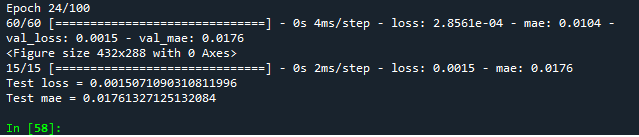

# Github Project 2 - Productivity Prediction of Garment Employees

 1. You are task to create a model to predict employees' productivity

 2. Link to the dataset 
      https://archive.ics.uci.edu/ml//datasets/Productivity+Prediction+of+Garment+Employees

 3. Criteria :
    a. The model should reach at least 90% accuracy for both training and validation.
    b. The model should not overfit 
    (validation loss needs to be within 10% difference with the training loss)
    
 4. You required to upload onto your Github
 
 
 
  
 
